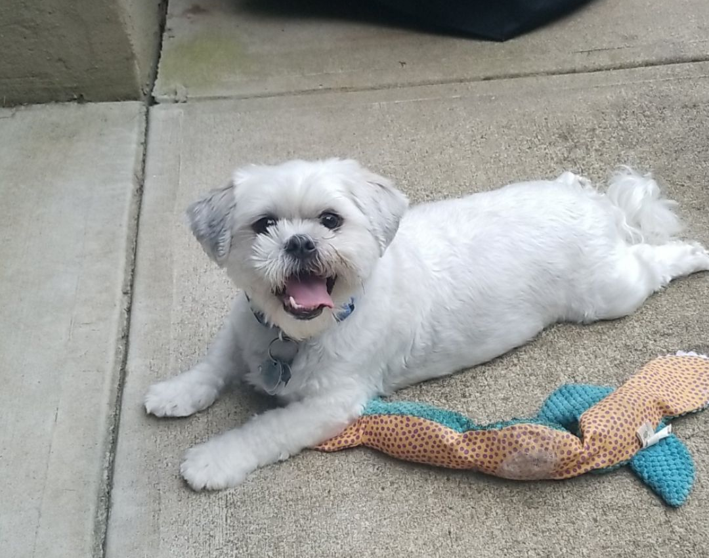
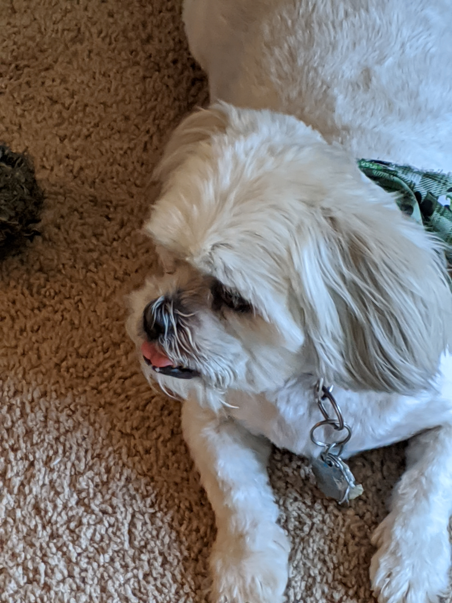
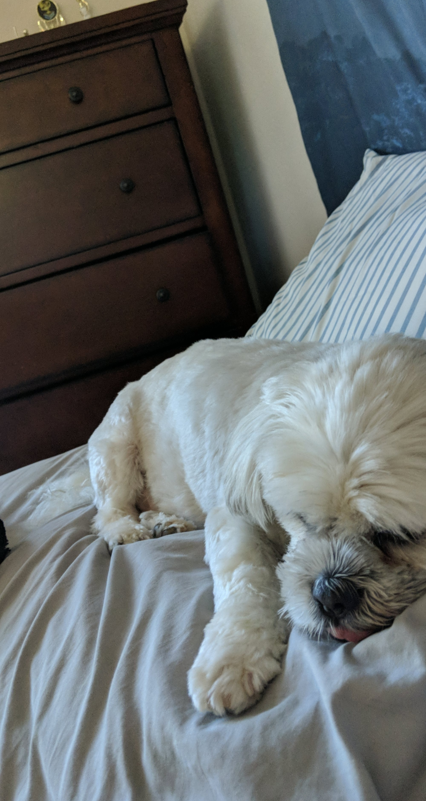
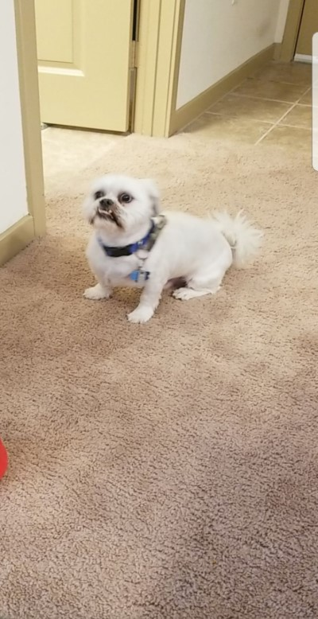

# Tontoken: A Decentralized Way of Helping Others 
Inspired by my adopted dog Tonto with the original goal of supporting animal shelters, this tradable ERC20 token aims to give back to organizations suggested and voted on by users while still providing the opportunity for cyrpto traders to make big profits.

### Contract Addresses
| Environment              | Address     |
| -----------              | ----------- |
| Mainnet                  | [0xCc01C55c0C57B93E22F3178A4B4FeA1843a05238](https://etherscan.io/address/0xcc01c55c0c57b93e22f3178a4b4fea1843a05238)         |
| Ropsten Testnet          | [0xf5cDd239Eb1965487E479E324281339d08eFe477](https://ropsten.etherscan.io/address/0xf5cdd239eb1965487e479e324281339d08efe477) |

## About
Tontoken bridges the gap between crypto daytraders and those who are struggling throughout the world. Why not help others while raking in those profits? __Tontoken can be traded just like any other ERC20 token over the Ethereum blockchain, but has charitable contributions built into its protocol. These contributions have no impact on Tontoken transactions, so everyone can keep their profits while simultaneously helping others.__ Holders of Tontoken are entitled (but NOT required) to suggest and vote on organizations that receive contributions. The Tontoken protocol is entirely decentralized, so users have complete control.

## Who is Tonto?
Tonto is my adopted dog and the inspiration for Tontoken. He was a neglected little dude who just needed some love, care, and lots of food. I thought of Tontoken when I was trying to create a way for animal shelters to be able to receive donations without anyone having to explicitly donate. Many people don't know how to donate, and many others don't want to put forth the time and effort. Suddenly, ideas took root: Why not create a currency that donates itself? Why limit the donations to animal shelters? Why not help anyone the community deems worthy? Tontoken: the Tonto-approved token.

   
   
   
   
   
   
   

## Tontoken Protocol
* Starts with an initial supply of 1,000,000 TONT
* There is no supply cap
* Each Tontoken can be divided into 1,000,000 Borks (my adopted dog loves barking)
* The contract matches 1.5% of every transaction amount by minting the equivalent amount in new Borks (the "Bork Tax")
    * The newly minted Borks are placed in a "Bork Pool" for 7 days with the contract as the designated owner
    * Before voting begins, Tontoken holders can propose recipients of the Bork Pool
    * Every 7 days, Tontoken holders can vote on which addresses should receive the Bork Pool
    * The winner will receive the entirety of the Bork Pool
* The "Bork Tax" is not actually a tax since no amount is subtracted from the transaction, but instead newly minted
* Holders can use Tontoken's built-in APIs to get information about candidates and suggest them

## How Voting Works
* _Voting is __NOT REQUIRED__ but encouraged for reasons mentioned later_
* Voting can be in an ACTIVE or INACTIVE state at any given time
    * During the 7 days leading to a voting session, voting is INACTIVE
    * For 1 day every 7 days, voting is ACTIVE
* Roughly every 7 days, a voting session will be automatically started that will last for approximately 1 day as determined by the number of blocks mined since the last voting session (assuming ~1 block mined every 15 seconds)
* Any Tontoken holder with a balance of at least 10,000 TONT will be eligible to vote when voting is ACTIVE.
* Any Tontoken holder with a balance of at least 50,000 TONT is eligible to propose recipients when voting is INACTIVE.
* In the event of a tie, voting will be extended 1 day
* In the event of no votes cast, voting will be postponed 7 days
* If there is only one candidate, that candidate shall be declared the uncontested winner and voting shall not become ACTIVE
* Each address can propose a max of 1 candidate each voting cycle
* Each address can vote for a max of 1 candidate each active voting session

## How to Suggest Candidates
* Only an address for the candidate is required to suggest them, but other optional pieces of information are highly encouraged to allow community members to make informed decisions:
    * __Name__ of the person, group, or org owning the address
    * __Description__ of the person, group, or org owning the address
    * __Website__ of the person, group, or org owning the address

## Locked Tokens
* To prevent holders from placing multiple votes or suggesting multiple candidates by shifting Tontokens between addresses, tokens are _TEMPORARILY_ locked from use
    * 10,000 TONT are locked when an address votes
    * 50,000 TONT are locked when an address suggests a candidate
    * Locked TONT are unlocked at the end of each ACTIVE voting session
    * Locked TONT are still included in an address's available balance, but are not sendable until unlocked
* Ex: An address with 100,000 TONT suggests a candidate to receive the Bork Pool 2 days before voting begins. This address still has 100,000 TONT, but is only able to send up to 50,000. When voting begins, this address votes for a candidate. This address can now only send up to 40,000 TONT. As soon as voting ends, the address is able to send up to 100,000 TONT once again.

## Tokenomics
* Tontoken's main voting functionality and "Bork Pool" are directly reliant on the volume of transactions. As a result, it is not meant to be held for long periods of time, but rather as a means of payment for goods and services and daytrading :rainbow:
    * Remember 1.5% of all transactions in an 8-day period (the Bork Pool still increases while voting is ACTIVE) will be added to the total supply at the end of each voting session

## Importance of Community Participation
* Tontoken depends on community involvement to both suggest and vote on deserving candidates.
* There is nothing stopping someone from suggesting themselves to increase their own holdings
* An active community will ensure the winners of the Bork Pools are deserving of the funds they receive
    * Who doesn't like helping those in need while making BANK :dollar::chart:?!?!
